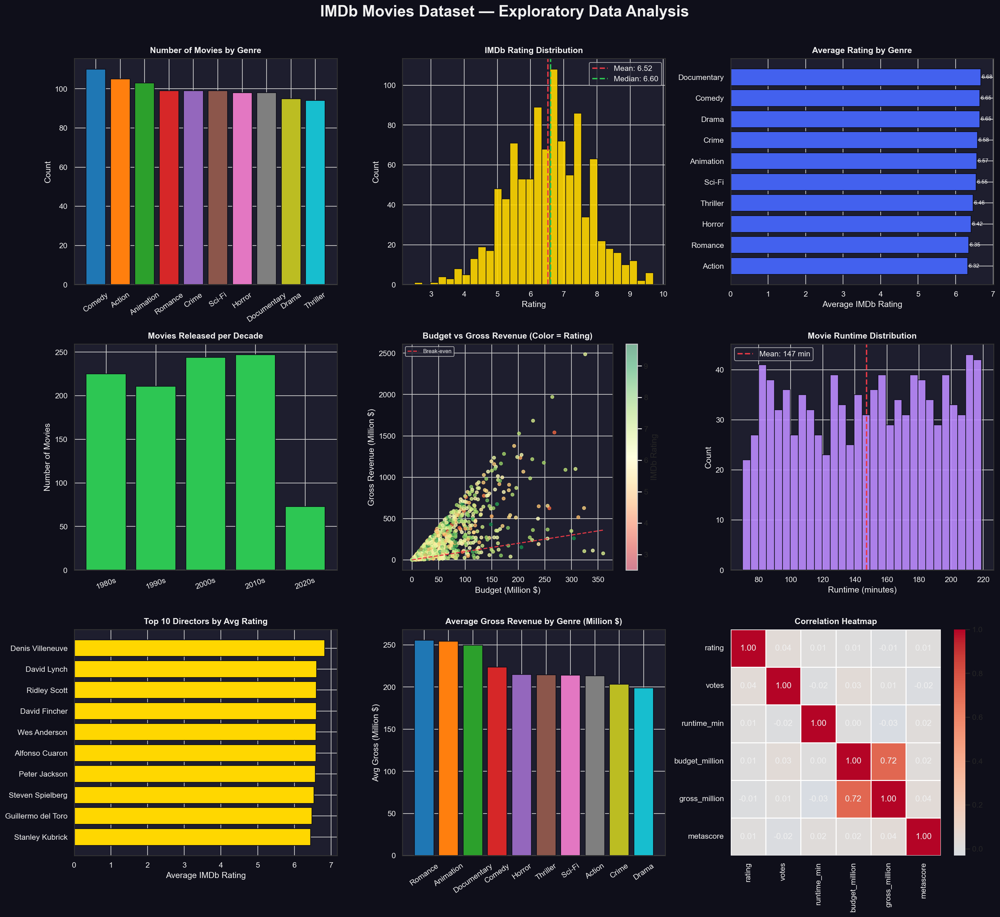

# 🎬 IMDb Movies Dataset — Exploratory Data Analysis

### CodeAlpha Data Analytics Internship – Task 2

This project performs Exploratory Data Analysis (EDA) on an IMDb Movies dataset using Python data analysis and visualization techniques. The objective is to uncover patterns in movie ratings, genres, revenues, budgets, runtimes, and director performance through an interactive dashboard.


## 📌 Project Overview

Movies generate massive amounts of data related to ratings, revenue, budgets, genres, and audience engagement. This project analyzes IMDb movie data to identify trends and relationships among different movie attributes.

The analysis explores genre popularity, rating distributions, financial performance, director success, runtime characteristics, and correlations between key variables through a comprehensive dashboard.


## 🎯 Objectives

* Analyze movie distribution across genres.
* Study IMDb rating patterns.
* Compare average ratings among genres.
* Examine movie releases across decades.
* Analyze the relationship between budget and revenue.
* Identify top-performing directors.
* Explore revenue generation by genre.
* Generate insights through data visualization.


## 📊 Dataset Information

The dataset contains information about movies from different genres, countries, languages, and directors.

### Features Used

| Feature                   | Description               |
| ------------------------- | ------------------------- |
| Title                     | Movie title               |
| Genre                     | Movie genre               |
| Year                      | Release year              |
| Rating                    | IMDb rating               |
| Votes                     | Number of IMDb votes      |
| Runtime (min)             | Movie duration in minutes |
| Director                  | Director name             |
| Language                  | Movie language            |
| Country                   | Country of production     |
| Budget (Million $)        | Production budget         |
| Gross Revenue (Million $) | Total revenue generated   |
| Metascore                 | Critic review score       |
| Profit (Million $)        | Revenue minus budget      |
| ROI (%)                   | Return on Investment      |


## 📈 Analysis Performed

* Genre Distribution Analysis
* IMDb Rating Analysis
* Genre-wise Rating Comparison
* Decade-wise Movie Analysis
* Budget vs Revenue Analysis
* Runtime Analysis
* Director Performance Analysis
* Revenue Analysis by Genre
* Correlation Analysis
* Dashboard Visualization


## 📊 Dashboard Visualizations

The generated dashboard (`imdb_eda.png`) includes:

| Visualization                      | Purpose                                |
| ---------------------------------- | -------------------------------------- |
| Number of Movies by Genre          | Analyze genre popularity               |
| IMDb Rating Distribution           | Study rating patterns                  |
| Average Rating by Genre            | Compare genre performance              |
| Movies Released per Decade         | Historical production analysis         |
| Budget vs Gross Revenue            | Financial performance analysis         |
| Movie Runtime Distribution         | Study runtime characteristics          |
| Top 10 Directors by Average Rating | Compare director performance           |
| Average Gross Revenue by Genre     | Revenue comparison                     |
| Correlation Heatmap                | Identify relationships among variables |


## 🔑 Key Findings

### 🎥 Genre Analysis

* Comedy emerged as one of the most common genres.
* Genre distribution was relatively balanced across the dataset.
* Documentary, Animation, and Drama genres received strong audience ratings.

### ⭐ IMDb Ratings

* The average IMDb rating was approximately 6.5.
* Most movies received ratings between 5 and 8.
* The rating distribution followed a near-normal pattern.

### 🎬 Director Performance

Top-performing directors based on average IMDb ratings included:

* Denis Villeneuve
* David Lynch
* Ridley Scott
* David Fincher
* Wes Anderson

These directors consistently achieved higher audience ratings.

### 💰 Budget and Revenue Analysis

* Higher-budget movies generally generated higher revenues.
* A strong positive relationship existed between budget and gross revenue.
* Many successful movies significantly exceeded their production costs.

### ⏳ Runtime Analysis

* Average movie runtime was approximately 147 minutes.
* Most movies ranged between 90 and 200 minutes.
* Runtime distribution remained relatively balanced.

### 📈 Revenue by Genre

* Romance and Animation genres generated some of the highest average revenues.
* Documentary and Comedy genres also showed strong financial performance.
* Revenue varied considerably across genres.

### 🔗 Correlation Analysis

* Budget and gross revenue showed a strong positive correlation.
* Ratings had weak correlations with financial variables.
* Runtime and votes demonstrated limited relationships with revenue.


## 🛠 Technologies Used

* Python
* Pandas
* NumPy
* Matplotlib
* Seaborn


## ⚙️ Installation

### Install Required Libraries

```bash
pip install pandas numpy matplotlib seaborn
```


## ▶️ How to Run

Execute the script:

```bash
python eda_imdb.py
```

The script will automatically:

1. Load or generate the IMDb movies dataset.
2. Perform exploratory data analysis.
3. Generate visualizations.
4. Create the EDA dashboard.
5. Save the dashboard as `imdb_eda.png`.


## 📁 Project Structure

```text
IMDb_Movies_EDA/
│
├── eda_imdb.py
├── imdb_movies.csv
├── imdb_eda.png
└── README.md
```


## 🖼 Output

<h2>🎬 IMDb Movies EDA Dashboard</h2>

<p align="center">
  
</p>


## 🚀 Future Enhancements

* Integrate real-world IMDb datasets.
* Develop interactive dashboards using Plotly and Streamlit.
* Build movie success prediction models.
* Perform country-wise and language-wise analysis.
* Analyze audience preferences using machine learning techniques.


## 👨‍💻 Author

**Penugonda Susmitha**

Bachelor of Technology (Computer Science and Engineering)

Sri Venkateswara College of Engineering

GitHub: https://github.com/Susmitha35-git


## 🙏 Acknowledgements

* CodeAlpha for providing the Data Analytics Internship opportunity.
* IMDb
* Python Open Source Community
* Pandas Development Team
* Matplotlib and Seaborn Communities
* Data Science Community


## 📄 License

This project is intended for educational and internship purposes.

⭐ If you found this project useful, consider giving it a star.
